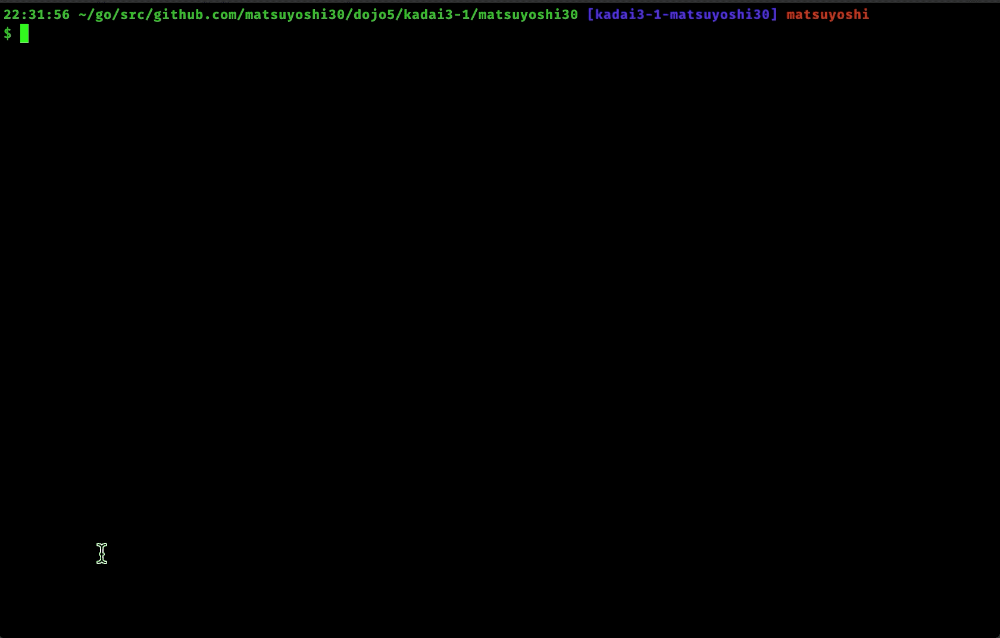

## 課題3-1: Typing Game

Simple Typing Game written in Go.

### Usage

```
$ make build
$ ./gotp [-lt limit time (sec)] [-wf source word file]
```

#### demo



##### Option

| flag | Usage |
|:----|:---- 
| `-lt=20` | Set Limit Time (second) [default: 20] |
| `-wf=default.txt` | Specify source word file [default: [default.txt](./default.txt)] |

### Test

```
$ make test
```

### Coverage

```
$ make cover
```

### Doc

```
$ make doc
```

### TODO

- [ ] main のテスト充実化
- [ ] レベル選択（レベル別テキスト用意）
- [ ] 正答率の高いキー、低いキーを表示
- [ ] 日本語対応
  - ```春はあけぼの（haruhaakebono）```
